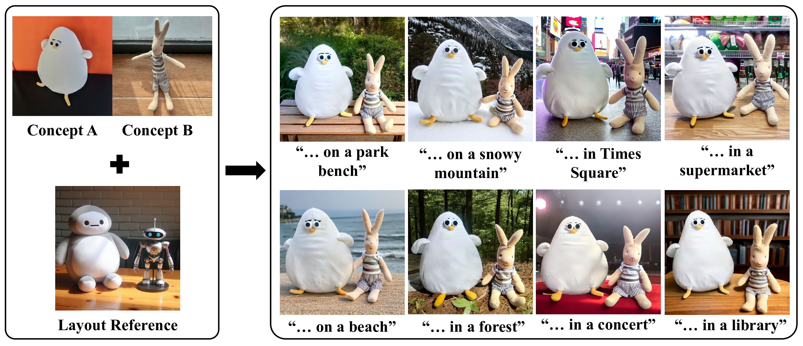
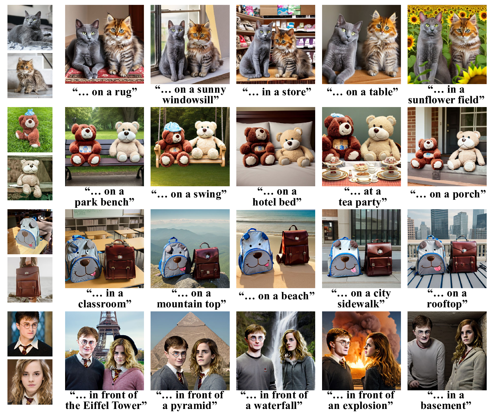
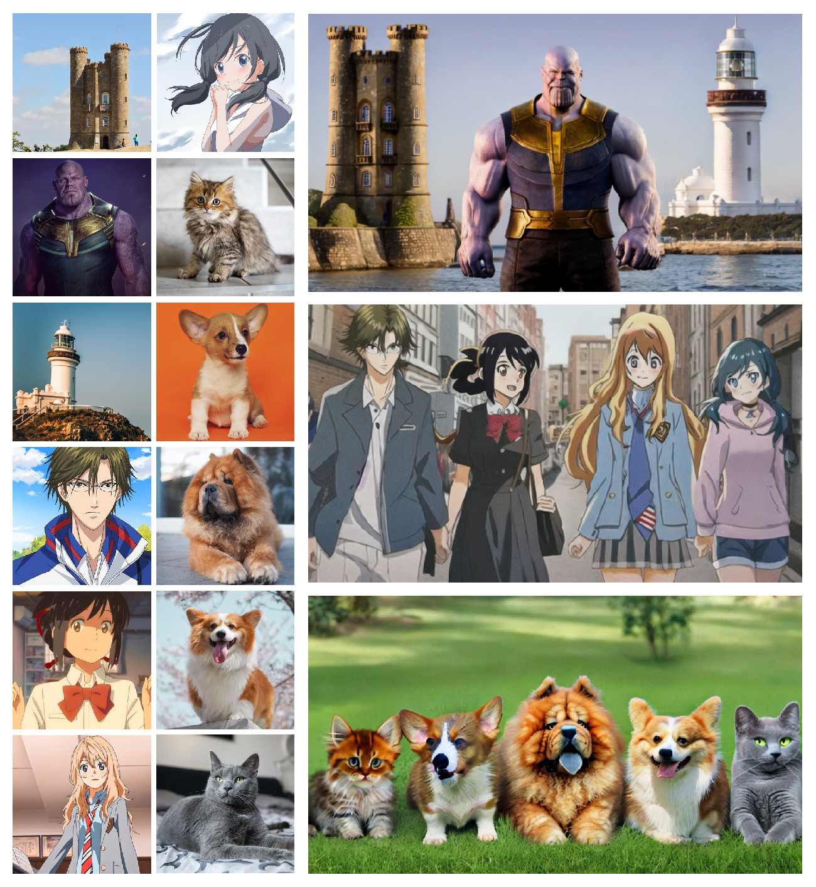

<div align="center">

<h1>Concept Conductor</h1>
<h3>Concept Conductor: Orchestrating Multiple Personalized Concepts in Text-to-Image Synthesis</h3>

Zebin Yao, &nbsp; Fangxiang Feng, &nbsp; Ruifan Li, &nbsp; Xiaojie Wang

[](https://arxiv.org/abs/2408.03632)

</div>



## 🔍 Results

### Combination of 2 Concepts:



### Combination of More Than 2 Concepts:




## 🛠️ Installation

```bash
git clone https://github.com/Nihukat/Concept-Conductor.git
cd Concept-Conductor
pip install -r requirements.txt
```

## 📝 Preparation

### Download Pretrained Text-to-Image Models.

Following [Mix-of-Show](https://github.com/TencentARC/Mix-of-Show), we adopt [ChilloutMix](https://civitai.com/models/6424/chilloutmix) for real-world concepts and [Anything-v4](https://huggingface.co/xyn-ai/anything-v4.0) for anime concepts.

```bash
git clone https://github.com/TencentARC/Mix-of-Show.git

cd experiments/pretrained_models

# Diffusers-version ChilloutMix
git-lfs clone https://huggingface.co/windwhinny/chilloutmix.git

# Diffusers-version Anything-v4
git-lfs clone https://huggingface.co/xyn-ai/anything-v4.0.git
```

### Download ED-LoRAs.

Download our trained ED-LoRAs from [Google Drive](https://drive.google.com/drive/folders/1roYyOL7e5Ivx3lvLAXz8XKY00sDLC377?usp=drive_link).

And then put them into ./experiments/ED-LoRAs

To train ED-LoRAs using your own images, we recommend using the latest official implementation of [Mix-of-Show](https://github.com/TencentARC/Mix-of-Show).

## 🚀 Usage

### Generate multiple personalized concepts

```bash
python sample.py \
--ref_prompt "A dog and a cat in the street." \
--base_prompt "A dog and a cat on the beach." \
--custom_prompts "A <chow_dog_1> <chow_dog_2> on the beach." "A <siberian_cat_1> <siberian_cat_2> on the beach."\
--ref_image_path "examples/a dog and a cat in the street.png" \
--ref_mask_paths "examples/a dog and a cat in the street_mask1.png" "examples/a dog and a cat in the street_mask2.png" \
--edlora_paths "experiments/ED-LoRAs/real/chow_dog.pth" "experiments/ED-LoRAs/real/siberian_cat.pth"

```

You can also pass parameters using a configuration file (like ./configs/sample_config.yaml) :

```bash
python sample.py --config_file "path/to/your/config.yaml"
```


## ✅ To-Do List

- [ ] Gradio Demo
- [ ] More Applications
- [x] Research Code


## 📚 Citation

If you find this code useful for your research, please consider citing:

```
@article{yao2024concept,
  title={Concept Conductor: Orchestrating Multiple Personalized Concepts in Text-to-Image Synthesis},
  author={Yao, Zebin and Feng, Fangxiang and Li, Ruifan and Wang, Xiaojie},
  journal={arXiv preprint arXiv:2408.03632},
  year={2024}
}
```<div align="center">

<h1>Concept Conductor</h1>
<h3>Concept Conductor: Orchestrating Multiple Personalized Concepts in Text-to-Image Synthesis</h3>

Zebin Yao, &nbsp; Fangxiang Feng, &nbsp; Ruifan Li, &nbsp; Xiaojie Wang

[](https://arxiv.org/abs/2408.03632)

</div>


## 🔍 Results

### Combination of 2 Concepts:


### Combination of More Than 2 Concepts:


## 🛠️ Installation

```bash
git clone https://github.com/Nihukat/Concept-Conductor.git
cd Concept-Conductor
pip install -r requirements.txt
```

## 📝 Preparation

### Download Pretrained Text-to-Image Models.

Following [Mix-of-Show](https://github.com/TencentARC/Mix-of-Show), we adopt [ChilloutMix](https://civitai.com/models/6424/chilloutmix) for real-world concepts and [Anything-v4](https://huggingface.co/xyn-ai/anything-v4.0) for anime concepts.

```bash
git clone https://github.com/TencentARC/Mix-of-Show.git

cd experiments/pretrained_models

# Diffusers-version ChilloutMix
git-lfs clone https://huggingface.co/windwhinny/chilloutmix.git

# Diffusers-version Anything-v4
git-lfs clone https://huggingface.co/xyn-ai/anything-v4.0.git
```

### Download ED-LoRAs.

Download our trained ED-LoRAs from [Google Drive](https://drive.google.com/drive/folders/1roYyOL7e5Ivx3lvLAXz8XKY00sDLC377?usp=drive_link).

And then put them into ./experiments/ED-LoRAs

To train ED-LoRAs using your own images, we recommend using the latest official implementation of [Mix-of-Show](https://github.com/TencentARC/Mix-of-Show).

## 🚀 Usage

### Generate multiple personalized concepts

```bash
python sample.py \
--ref_prompt "A dog and a cat in the street." \
--base_prompt "A dog and a cat on the beach." \
--custom_prompts "A <chow_dog_1> <chow_dog_2> on the beach." "A <siberian_cat_1> <siberian_cat_2> on the beach."\
--ref_image_path "examples/a dog and a cat in the street.png" \
--ref_mask_paths "examples/a dog and a cat in the street_mask1.png" "examples/a dog and a cat in the street_mask2.png" \
--edlora_paths "experiments/ED-LoRAs/real/chow_dog.pth" "experiments/ED-LoRAs/real/siberian_cat.pth"

```

You can also pass parameters using a configuration file (like ./configs/sample_config.yaml) :

```bash
python sample.py --config_file "path/to/your/config.yaml"
```


## ✅ To-Do List

- [ ] Gradio Demo
- [ ] More Applications
- [x] Research Code


## 📚 Citation

If you find this code useful for your research, please consider citing:

```
@article{yao2024concept,
  title={Concept Conductor: Orchestrating Multiple Personalized Concepts in Text-to-Image Synthesis},
  author={Yao, Zebin and Feng, Fangxiang and Li, Ruifan and Wang, Xiaojie},
  journal={arXiv preprint arXiv:2408.03632},
  year={2024}
}
```